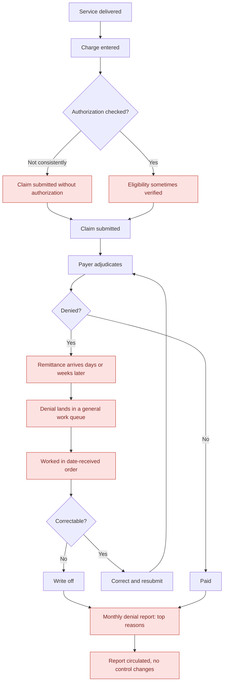

# As-Is Process Map — Denial Prevention Simulator

## Pain points

| # | Pain point | Effect in the data |
|---|---|---|
| P1 | No hard stop for missing authorization | Authorization reasons carry $1.96M of $5.42M denied |
| P2 | Eligibility verification is optional in practice | Eligibility denials $845K |
| P3 | Denials discovered only at remittance | Average 40+ days outstanding before work begins |
| P4 | One undifferentiated denial queue | No relationship between claim value and work order |
| P5 | Denials worked first-in-first-out | High-value recoverable claims age alongside $95 lab denials |
| P6 | Reporting is a post-mortem | Preventable share never measured, so controls never change |

## Cost of the current state

Denial rate 14.0%. First-pass acceptance 80.0%. Of $5.42M denied, $4.48M carried a reason a
pre-submission control could have caught. Claims flagged high timely-filing risk denied at
45.7% — an entirely process-created failure.
