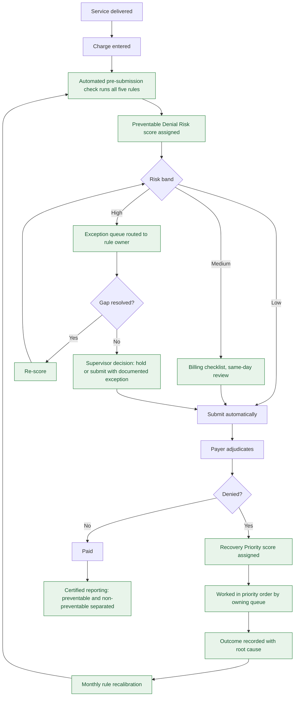

# To-Be Process Map — Denial Prevention Simulator

## Controls introduced

| Control | Addresses | Owner |
|---|---|---|
| Automated five-rule pre-submission check | P1, P2 | Billing Manager |
| Risk-band routing instead of claim-type routing | P3, P4 | Billing Manager |
| Owner-assigned exception queues | P1, P2 | Rule owners per `prevention_rules.csv` |
| Documented submit-with-exception path | avoids new backlogs | Billing Supervisor |
| Recovery priority ordering | P5 | Denial Analyst |
| Root-cause capture at resolution | P6 | Revenue Cycle Director |
| Monthly rule recalibration | P6 | Revenue Cycle Director |
| Separated preventable reporting | P6 | Analyst |

The submit-with-documented-exception path matters. A hard hold with no release valve just
converts a denial problem into an aging problem, which is how well-intentioned edit rules get
switched off six months later.
